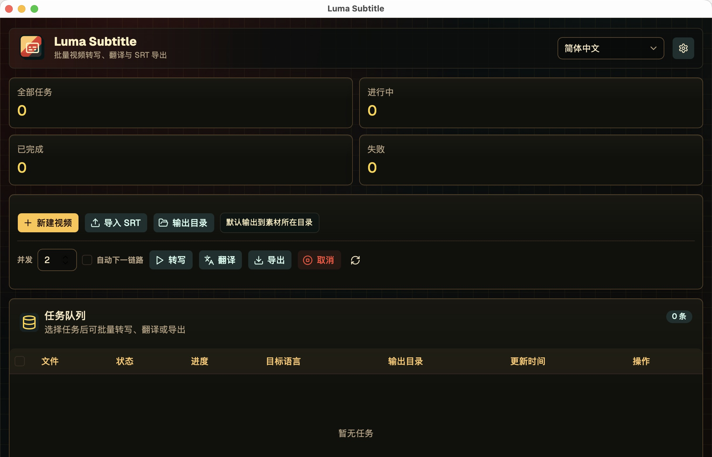

# Luma Subtitle

[简体中文](README.zh-CN.md)

Luma Subtitle is a desktop app for generating, translating, and exporting video subtitles. After you import a video, the app extracts audio with FFmpeg, transcribes it locally with whisper.cpp, translates the subtitles through an OpenAI-compatible `/v1/chat/completions` API, and exports standard SRT files.

It is built for individual creators, course editors, interview workflows, and multilingual content production. Transcription, subtitle translation, model setup, dependency checks, task queues, and exports all live in one local desktop workspace.

The macOS build targets Apple Silicon. Automatic FFmpeg and whisper.cpp builds require macOS 11.0 or later, Xcode Command Line Tools, and `cmake`; whisper.cpp is built with the Metal backend.

## Screenshot



## Features

- Video import and task management: choose video files, output folders, source language, target language, and translation settings.
- Local transcription: run whisper.cpp on your machine and select local Whisper model files.
- Subtitle translation: use any OpenAI-compatible Chat Completions API with configurable Base URL, model name, and API key.
- SRT export: generate source and translated subtitle files for editors, players, and subtitle tooling.
- Task queue: batch transcribe, translate, and export; optionally enable automatic chaining from transcription to translation to export.
- Environment panel: check FFmpeg, whisper.cpp, model folders, dependency folders, and download supported presets.
- Platform focus: Windows x64 and macOS Apple Silicon.

## Privacy And Credentials

- Video processing, audio extraction, and whisper.cpp transcription run locally.
- Translation sends subtitle text to the OpenAI-compatible API endpoint configured by the user.
- API keys are stored in the local SQLite database under the app user data directory.
- Do not commit local models, FFmpeg/whisper binaries, task artifacts, development logs, personal settings, or API keys.

## Tech Stack

- Tauri 2
- React 18
- TypeScript
- Vite
- Rust
- whisper.cpp
- FFmpeg

## Supported Platforms

- Windows x64: the app selects a CUDA whisper.cpp package when an NVIDIA GPU is available, otherwise it uses a BLAS/CPU package.
- macOS Apple Silicon: the app first uses installed or bundled arm64 `ffmpeg` and `whisper-cli`; if missing, it can build FFmpeg and Metal-enabled whisper.cpp from official source archives.

Intel Mac is not currently supported.

## Development Requirements

- Node.js 20+
- pnpm 9+
- Rust 1.80+
- Windows: NVIDIA driver and CUDA-capable GPU optional for faster transcription
- macOS Apple Silicon: macOS 11.0+, Xcode Command Line Tools, and `cmake`

## Install Dependencies

```powershell
pnpm install
```

## Prepare Local Runtime Dependencies

The in-app Environment panel shows the fixed dependency folder and model folder.

Clicking "Download to dependency folder" will:

- Windows: download and extract `ffmpeg.exe` and the best matching CUDA, BLAS, or CPU `whisper-cli.exe`.
- macOS Apple Silicon: use installed or bundled dependencies first; if missing, download official source archives and build locally. It does not call Homebrew or download unofficial macOS binaries.

macOS automatic build requirements:

- Apple Silicon device running macOS 11.0 or later.
- Xcode Command Line Tools installed, with `clang`, `make`, `tar`, and `sh` available.
- `cmake` installed for configuring and building whisper.cpp.
- Network access to FFmpeg official source archives and `ggml-org/whisper.cpp` GitHub release source archives.

macOS build sources and configuration:

- FFmpeg is downloaded from `https://ffmpeg.org/releases/` and built locally with `VideoToolbox`, `AudioToolbox`, and `AVFoundation` enabled.
- whisper.cpp is downloaded from official `ggml-org/whisper.cpp` GitHub release source archives and built with CMake using `GGML_METAL=ON`.
- whisper.cpp explicitly uses the `macOS 11.0` deployment target for Apple Silicon and C++17 `std::filesystem` compatibility.

To skip in-app compilation, pre-bundle dependencies in the release process or install them to the user's PATH. During development, you can also place executables at:

- `src-tauri/resources/bin/macos-arm64/ffmpeg`
- `src-tauri/resources/bin/macos-arm64/whisper-cli`

Release builds bundle files under `src-tauri/resources`. macOS executables must keep executable permissions:

```zsh
chmod +x src-tauri/resources/bin/macos-arm64/ffmpeg
chmod +x src-tauri/resources/bin/macos-arm64/whisper-cli
```

Lookup order: app data directory, bundled resources, common macOS executable paths, then system PATH.

Whisper models can live anywhere. Select the model file in the app. On Apple Silicon, `large-v3-turbo-q5_0` or `small` are good starting points depending on memory and speed requirements.

## Whisper Model Presets

The in-app model presets download into the app data directory's `models` folder and automatically update the selected Whisper model path. You can also download these files manually and select them in the app:

| Preset | File | Size | Download |
| --- | --- | --- | --- |
| tiny | `ggml-tiny.bin` | 75 MiB | https://huggingface.co/ggerganov/whisper.cpp/resolve/main/ggml-tiny.bin |
| base | `ggml-base.bin` | 142 MiB | https://huggingface.co/ggerganov/whisper.cpp/resolve/main/ggml-base.bin |
| small | `ggml-small.bin` | 466 MiB | https://huggingface.co/ggerganov/whisper.cpp/resolve/main/ggml-small.bin |
| large-v3-turbo-q5_0 | `ggml-large-v3-turbo-q5_0.bin` | 547 MiB | https://huggingface.co/ggerganov/whisper.cpp/resolve/main/ggml-large-v3-turbo-q5_0.bin |

## Run

```powershell
pnpm tauri:dev
```

The same command works on macOS.

## Build

```powershell
pnpm tauri:build
```

For production macOS distribution, handle `.icns` icons, codesigning, and notarization on a macOS machine.

## App Updates

Luma Subtitle uses the official Tauri updater plugin. Release builds publish signed update artifacts and `latest.json` to GitHub Releases.

Generate the updater signing key once:

```zsh
pnpm tauri signer generate -w ~/.tauri/luma-subtitle.key
```

Store the private key content in the GitHub secret `TAURI_SIGNING_PRIVATE_KEY`. If you protect the key with a password, store it in `TAURI_SIGNING_PRIVATE_KEY_PASSWORD`. The public key is committed in `src-tauri/tauri.conf.json`.

The app checks:

```text
https://github.com/csic21/luma-subtitle/releases/latest/download/latest.json
```

## Output

Each task can generate:

- `{video_name}.source.srt`
- `{video_name}.{target_language}.srt`

Intermediate task files are written under `.luma-subtitle-work` inside the output folder.

## Repository Hygiene

Before committing, make sure you do not include:

- `.env`, `.env.*`, private keys, certificates, tokens, or real API keys.
- `node_modules/`, `dist/`, or `src-tauri/target/`.
- Local development logs, layout-check screenshots, Whisper models, or FFmpeg/whisper binaries.

## License

Luma Subtitle is licensed under the GNU General Public License v3.0 or later. See [LICENSE](LICENSE) for details.
